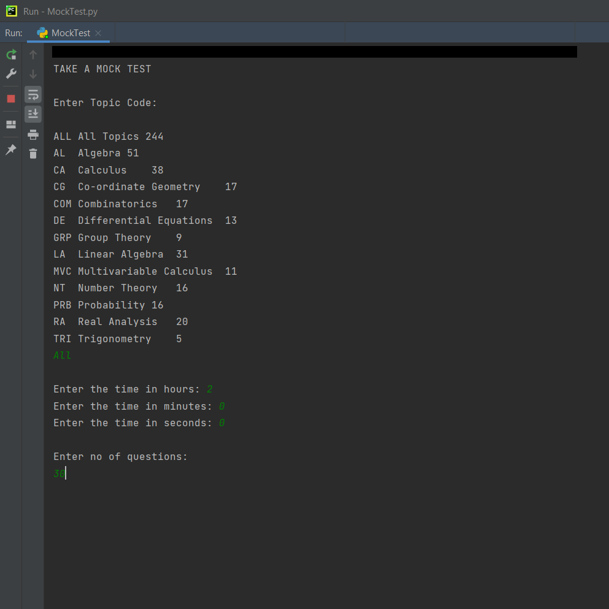
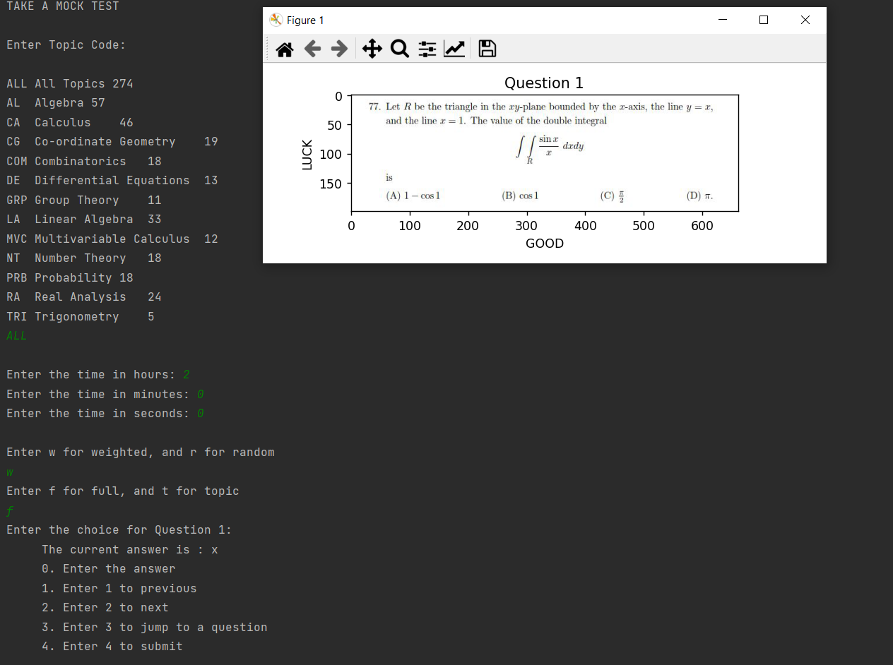

# MockTest App
A simple program that provides a timed-test environment to solve multiple choice questions in mathematics.

## Description:
- The number of questions and the amount of time is entered in the beginning
- The time starts and the questions are displayed
- You can choose the correct option for a question, and navigate through the questions
- When time is up, you can submit your answers
- After submission, the scores are displayed and the questions are displayed for review

This program uses the following libraries in Python:
- pyplot
- image
- pandas
- random
- time
- threading

Google Drive Download Link:
https://drive.google.com/drive/folders/1icSCAB7YPPGftFxxkfyvwYODrp5y7aW6?usp=share_link

## Set-up:
- Install PyCharm
- Install Anaconda
- Download the Folder from the drive link into your local machine, and use the files.
- Open 'MockTest.py' in the 'venv' folder to run the program.

## Snapshots

1. Start Screen:

2. Test Screen:

